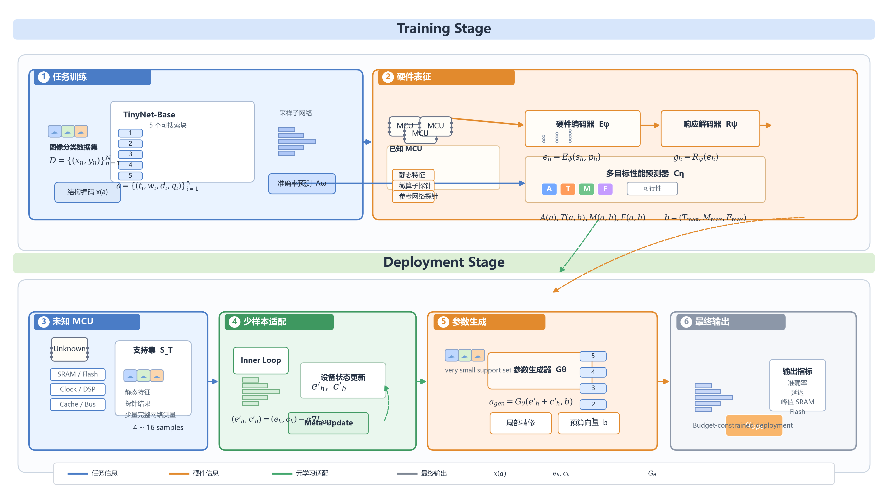
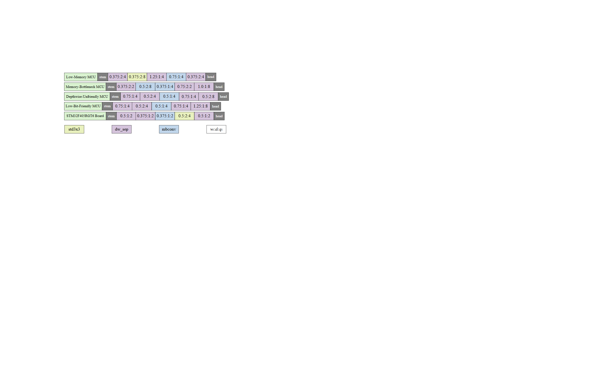
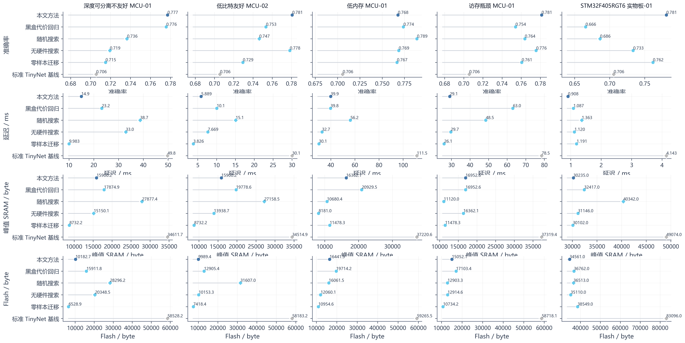
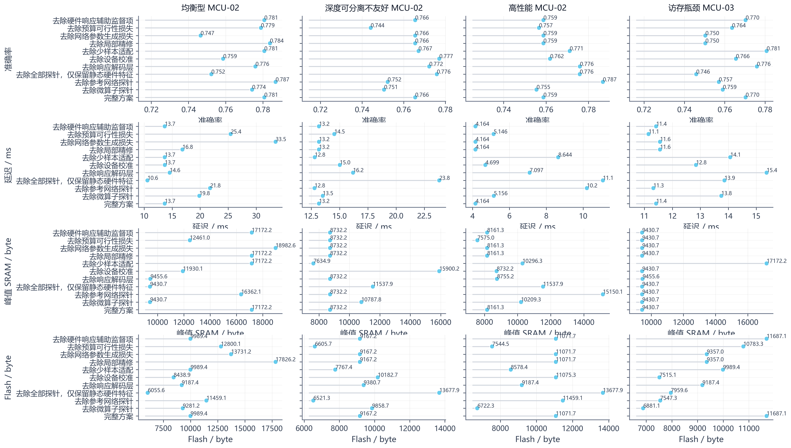

# Hardware-Adaptive Few-Shot TinyNet-Base for Unknown MCUs

This repository contains the code and firmware used for hardware-adaptive few-shot deployment of TinyNet-Base models on unknown MCUs. It covers synthetic device construction, hardware-conditioned meta-learning, support-set collection on a real `STM32F405RGT6` board, and the benchmark and ablation procedures reported in the paper.

## Overview

The repository is organized around three parts:

- TinyNet-Base definition and search-space encoding;
- hardware-conditioned few-shot adaptation for unseen MCUs;
- evaluation on synthetic MCUs and a real `STM32F405RGT6` board.



## Representative figures

Final TinyNet-Base configurations selected on the five test MCUs:



Per-device comparison of the benchmark methods:



Per-device ablation results:



## Repository structure

```text
.
|- src/fewshot_hc_nas/               core Python package
|- scripts/                          stage runners and CLI utilities
|- configs/
|  |- eval/                          main experiment and benchmark configs
|  |- hardware/                      serial-board configuration
|  `- data/                          synthetic device generation config
|- tests/
|  |- unit/                          unit tests
|  `- integration/                   integration tests
|- firmware/stm32f405_runner/        STM32F405RGT6 UART benchmark runner
|- docs/
|  |- figures/                       workflow and result figures
|  `- *.md                           workflow notes
|- data/                             local generated artifacts (created at runtime)
|- pyproject.toml
|- requirements.txt
`- README.md
```

## Requirements

- Python `>=3.11`
- Recommended: a dedicated virtual environment
- PyTorch environment for training and evaluation
- Optional CUDA-enabled PyTorch for faster training
- Keil MDK / uVision if you want to rebuild the STM32 firmware

Install dependencies:

```bash
pip install -r requirements.txt
```

## Quick start

### 1. Run the synthetic MCU pipeline

Main experiment config:

```text
configs/eval/experiment_synthetic_cifar10.yaml
```

Typical stage order:

```bash
python scripts/run_stage.py --stage prepare_data --config configs/eval/experiment_synthetic_cifar10.yaml
python scripts/run_stage.py --stage train_supernet --config configs/eval/experiment_synthetic_cifar10.yaml
python scripts/run_stage.py --stage build_accuracy_dataset --config configs/eval/experiment_synthetic_cifar10.yaml
python scripts/run_stage.py --stage build_synth_devices --config configs/eval/experiment_synthetic_cifar10.yaml
python scripts/run_stage.py --stage train_hardware_models --config configs/eval/experiment_synthetic_cifar10.yaml
python scripts/run_stage.py --stage meta_eval --config configs/eval/experiment_synthetic_cifar10.yaml
```

### 2. Bring up the real board

Serial config:

```text
configs/hardware/stm32f405rgt6_uart.yaml
```

Update the `port` field before running.

Quick checks:

```bash
python scripts/ping_serial_board.py --config configs/hardware/stm32f405rgt6_uart.yaml --cmd ping
python scripts/ping_serial_board.py --config configs/hardware/stm32f405rgt6_uart.yaml --cmd get_static
python scripts/ping_serial_board.py --config configs/hardware/stm32f405rgt6_uart.yaml --cmd run_probe_suite
python scripts/ping_serial_board.py --config configs/hardware/stm32f405rgt6_uart.yaml --cmd run_reference_suite
```

### 3. Collect support data and deploy on the board

```bash
python scripts/run_stage.py --stage collect_real_board_support --config configs/eval/collect_stm32f405rgt6_support_command.yaml
python scripts/run_stage.py --stage deploy_new_device --config configs/eval/deploy_stm32f405rgt6_command.yaml
```

### 4. Run the five-device benchmark

```bash
python scripts/run_stage.py --stage benchmark_new_boards --config configs/eval/board_benchmark_synthetic_cifar10_with_real_stm32f405rgt6.yaml
```

### 5. Run ablations

```bash
python scripts/run_stage.py --stage benchmark_new_boards --config configs/eval/board_benchmark_synthetic_cifar10_with_real_stm32f405rgt6_ablation_full.yaml
python scripts/run_stage.py --stage benchmark_new_boards --config configs/eval/board_benchmark_synthetic_cifar10_with_real_stm32f405rgt6_no_probes.yaml
python scripts/run_stage.py --stage benchmark_new_boards --config configs/eval/board_benchmark_synthetic_cifar10_with_real_stm32f405rgt6_no_refs.yaml
python scripts/run_stage.py --stage benchmark_new_boards --config configs/eval/board_benchmark_synthetic_cifar10_with_real_stm32f405rgt6_static_only.yaml
python scripts/run_stage.py --stage benchmark_new_boards --config configs/eval/board_benchmark_synthetic_cifar10_with_real_stm32f405rgt6_no_adaptation.yaml
python scripts/run_stage.py --stage benchmark_new_boards --config configs/eval/board_benchmark_synthetic_cifar10_with_real_stm32f405rgt6_no_refinement.yaml
python scripts/run_stage.py --stage benchmark_new_boards --config configs/eval/board_benchmark_synthetic_cifar10_with_real_stm32f405rgt6_no_feasibility_loss.yaml
python scripts/run_stage.py --stage benchmark_new_boards --config configs/eval/board_benchmark_synthetic_cifar10_with_real_stm32f405rgt6_no_generator_loss.yaml
python scripts/run_stage.py --stage benchmark_new_boards --config configs/eval/board_benchmark_synthetic_cifar10_with_real_stm32f405rgt6_no_response_aux_loss.yaml
```

## Tests

Run the test suite with the active Python environment:

```bash
python scripts/run_tests.py
```

## Firmware

The STM32 benchmark runner is included under:

```text
firmware/stm32f405_runner
```

Key files:

- `firmware/stm32f405_runner/Core/Src/main.c`
- `firmware/stm32f405_runner/MDK-ARM/AI_Proc.uvprojx`

Additional board notes are documented in:

```text
docs/stm32f405_real_board_workflow.md
```

## Reproducibility notes

- Generated data, checkpoints, and paper tables are not bundled.
- Runtime artifacts are expected under `data/generated/` and `data/checkpoints/`.
- The firmware directory includes third-party STM32 and CMSIS components required for reproducible builds.
- See [THIRD_PARTY_NOTICES.md](THIRD_PARTY_NOTICES.md) for license notes on bundled vendor code.

## Citation

If you use this repository, please cite the accompanying paper metadata in [CITATION.cff](CITATION.cff).

## License

This repository is released under the MIT License for the original project code, except for bundled third-party components that retain their own licenses.

See:

- [LICENSE](LICENSE)
- [THIRD_PARTY_NOTICES.md](THIRD_PARTY_NOTICES.md)
